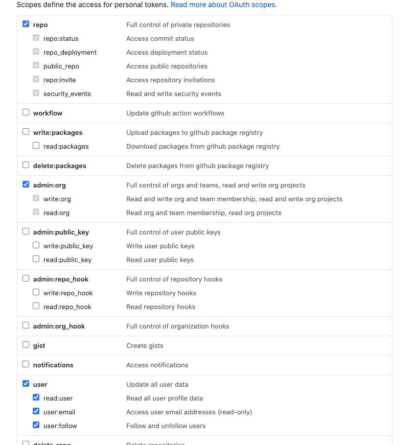

# automate-project-cards
Automate addition of task cards to GitHub Projects

## NOTE:

Until such time that OAuth is implemented, you will need to provide [your own auth token](https://docs.github.com/en/free-pro-team@latest/github/authenticating-to-github/creating-a-personal-access-token).

Give it the following permissions in order to use the app:


After generating your Access token, paste it as the value for the `auth` property in this section of `index.js`:
```js
const octokit = new Octokit({
  auth: "Access Token Here"
})
```
